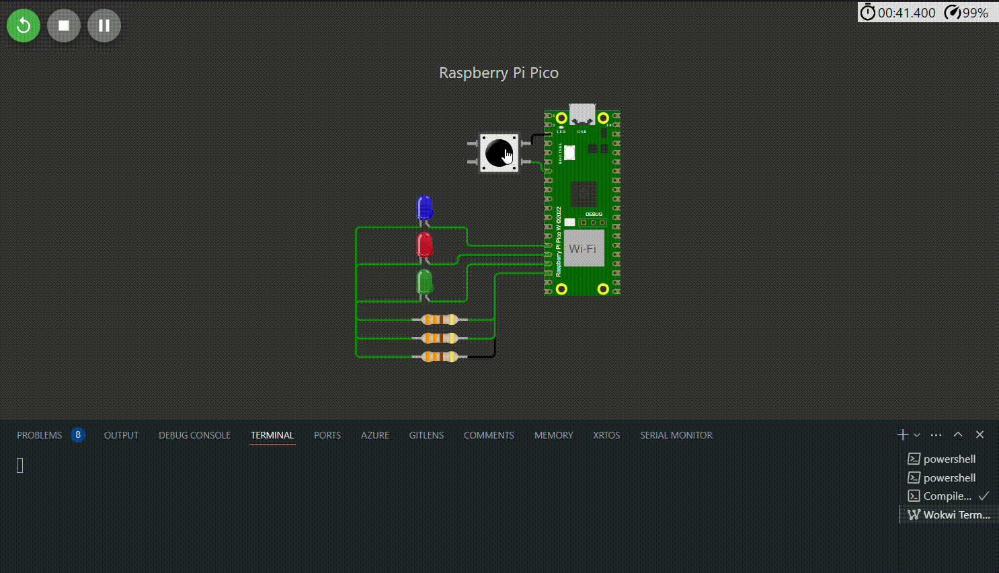

# Temporizador One Shot

## 📝 Sobre o Projeto

Este projeto implementa um sistema de temporização para o acionamento e desligamento sequencial de LEDs a partir do clique em um botão (pushbutton). O sistema segue uma lógica de transição de estados entre os LEDs usando temporizadores e callbacks.

## 🎯 Funcionalidades

1. O botão é conectado ao GPIO 5 e configurado como entrada com pull-up.

2. Quando o botão é pressionado, o sistema inicia a sequência de iluminação e posterior desligamento dos LEDs.

3. Todos os LEDs são acesos simultaneamente.

4. Após 3 segundos:

   - O LED azul apaga.

   - Após mais 3 segundos, o LED vermelho apaga.

   - Após mais 3 segundos, o LED verde apaga e o sistema volta a aguardar outro pressionamento do botão.

## 📂 Estrutura do Projeto

O projeto é composto pelos seguintes arquivos principais:

- `OneShot.c`: Contém a lógica principal do sistema.
- `CMakeLists.txt`: Arquivo de configuração do CMake para compilação do projeto.
- `diagram.json`: Arquivo utilizado para simular o hardware.

## 🛠️ Requisitos

- Raspberry Pi Pico W
- 03 LEDs (Azul - GPIO 11, Vermelho - GPIO 12, Verde - GPIO 13)
- 03 Resistores de 330 Ω
- Botão (Pushbutton - GPIO 5)
- SDK do Pico instalado
- CMake
- Compilador compatível com C e C++

## ⚙️ Compilação e Execução

1. Clone o repositório do projeto:
   ```sh
   git clone https://github.com/thalissoncastrog/embedded-system-periodic-timer.git
   cd embedded-system-one-shot-timer
   ```
2. Crie um diretório de build e entre nele:
   ```sh
   mkdir build
   cd build
   ```
3. Execute o comando CMake para configurar a compilação:
   ```sh
   cmake ..
   ```
4. Compile o projeto:
   ```sh
   make
   ```
5. Faça o upload do binário gerado para a Raspberry Pi Pico.

## 🎯 Resultado



## 👥 Colaboradores

1. **Adão Thalisson Castro Guimarães** - [GitHub](https://github.com/thalissoncastrog)

## 📜 Licença

Este projeto está licenciado sob a Licença MIT. Para mais detalhes, consulte o arquivo LICENSE.
